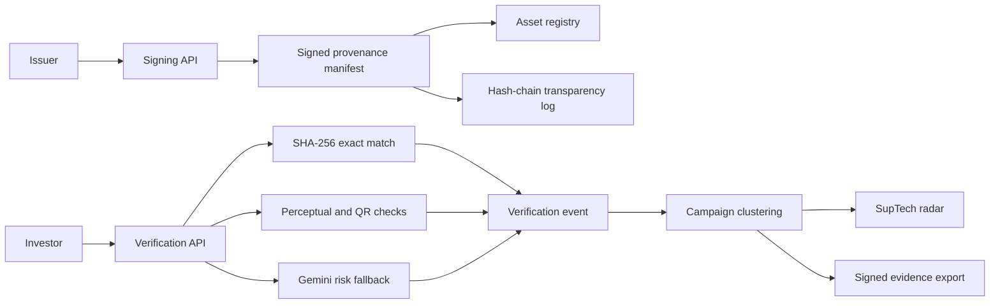

# PramaanSetu

**Proof before persuasion.**

PramaanSetu helps investors check whether a securities-market communication
really came from the organisation named in it. Issuers can sign official
messages and media, investors can verify suspicious content, and regulators can
see related fraud reports as connected campaigns.

Built for SEBI Securities Market TechSprint 2026, Problem Statement 1:
AI-driven detection of synthetic media and phishing.

> Prototype status: the application runs locally and the deterministic
> verification flow is tested. It is not connected to SEBI's production
> registry and is not ready for enforcement or public deployment.

## The problem

Investment scams often borrow the visual identity of SEBI, exchanges, brokers,
and listed companies. A polished PDF, forwarded image, payment QR, or social
post can look official even when it was created by an impersonator.

An AI classifier can flag suspicious language, but it cannot prove who
published a file. It can also produce uncertain results that should not be
treated as confirmed fraud.

PramaanSetu separates those questions:

1. Can the content be matched to a signed communication?
2. Does the issuer signature validate?
3. Was the content copied, recompressed, or altered?
4. If no provenance exists, does the message contain phishing signals?
5. Do multiple reports share the same payment handle, phone number, domain, or
   impersonated entity?

## What the project includes

### Signing rail

An issuer creates a provenance manifest containing its identity, the content
hash, publication time, approved payment handles, and an optional official
URL. The backend signs the manifest with Ed25519 and adds the asset to a
hash-chained transparency log.

### Investor verifier

An investor can paste a message or upload a file. The verifier checks exact
provenance first, then perceptual similarity and payment QR integrity. Gemini
is used only when no signed match can be found.

### SupTech radar

Verification events are grouped into campaigns when they share indicators.
The regulator view separates confirmed tampering from AI-scored suspicion and
exports signed evidence packs for review.

## Demo

There is no public deployment yet. After starting the project locally, these
screens are available:

| Screen | URL | Purpose |
| --- | --- | --- |
| Overview | <http://localhost:3000> | Product story and trust model |
| Investor verifier | <http://localhost:3000/verify> | Verify a message, image, video, audio file, or PDF |
| Signing rail | <http://localhost:3000/issuer> | Seed demo issuers and sign content |
| SupTech radar | <http://localhost:3000/dashboard> | Review metrics, campaigns, and shared indicators |

### Two-minute walkthrough

1. Open the signing rail and select **initialise demo registry**.
2. Choose a demo issuer, enter a title, and sign a short message.
3. Paste the exact message into the verifier. It should return
   `Verified Original` with a valid issuer signature.
4. Paste a suspicious investment message that includes a UPI handle or phone
   number. With Gemini configured, the verifier returns an AI risk assessment
   and extracts those indicators.
5. Open the SupTech radar to see the new verification events and any linked
   campaign.

The seed endpoint also generates an original image, a recompressed copy, and
an altered image with a replaced payment QR. These are returned as base64
values from `POST /api/seed` for deterministic API demonstrations.

## Architecture



The deterministic path runs before the AI path. A matching registry record is
not enough by itself. Its Ed25519 signature must also validate before the
content can be reported as genuine.

## Verification decisions

| Verdict | Meaning |
| --- | --- |
| `original` | Exact SHA-256 match, valid issuer signature, not revoked, and not expired |
| `derivative` | Perceptual match within the copy threshold, with valid provenance |
| `altered` | Matches a signed asset but contains a local visual edit or an unapproved payment QR |
| `invalid_provenance` | A matching registry record exists, but its signature does not validate |
| `revoked` | The issuer signed the content and later revoked it |
| `expired` | The signature is valid, but the communication is no longer current |
| `unverified` | No signed provenance match was found |

For images and sampled video frames, the current prototype uses a 32 by 32
colour block grid. Up to 4 changed cells is treated as a recompressed copy.
Between 5 and 300 changed cells is treated as a possible alteration. These
thresholds are prototype values and need calibration on real forwarded media.

## Evaluation

The repository contains a reproducible benchmark for the deterministic layer.
Gemini is disabled during this run so results do not depend on a model response
or network access.

```bash
npm run benchmark
```

Latest local run:

| Measurement | Result |
| --- | ---: |
| Exact originals | 100.0% (10/10) |
| Recompressed copy recall | 100.0% (40/40) |
| Altered-content recall | 100.0% (20/20) |
| False matches on unrelated images | 0.0% (0/10) |
| Latency p50 | 35.4 ms |
| Latency p95 | 72.0 ms |

The benchmark uses Jimp-generated templates, recompression, QR replacement,
and simple visual edits. It is useful as a regression check, not as a general
accuracy claim. It does not represent WhatsApp or Telegram forwarding,
screenshots, rotations, crops, real exchange documents, adversarial edits, or
different camera conditions.

## Tests

Run the backend test suite from the repository root:

```bash
npm test
```

The current suite contains nine tests covering:

- exact signed images and text
- recompressed image matching
- payment QR replacement
- unrelated content and false matches
- invalid signatures
- transparency log integrity
- campaign creation from a QR fraud event
- signed evidence packs

Run the full static checks with:

```bash
npm run typecheck
npm --prefix frontend run lint
npm --prefix frontend run build
```

## Quick start

### Prerequisites

- Node.js 20.9 or newer
- npm
- A Gemini API key if you want AI risk scoring for unverified content
- FFmpeg if you want video fingerprinting

### Install and run

```bash
git clone https://github.com/RajdeepKushwaha5/PramaanSetu.git
cd PramaanSetu

npm install
npm run install:all

cp backend/.env.example backend/.env
cp frontend/.env.example frontend/.env.local

npm run dev
```

On Windows PowerShell, replace the two `cp` commands with:

```powershell
Copy-Item backend/.env.example backend/.env
Copy-Item frontend/.env.example frontend/.env.local
```

The frontend runs on <http://localhost:3000>. The backend runs on
<http://localhost:4000>.

Signing and deterministic verification work without Gemini. If no Gemini key
is configured, AI risk analysis is reported as unavailable.

### Run each service separately

```bash
npm --prefix backend run dev
npm --prefix frontend run dev
```

## Configuration

### Backend

Configure `backend/.env`.

| Variable | Required | Default | Purpose |
| --- | --- | --- | --- |
| `GEMINI_API_KEYS` | No | Empty | Comma-separated Gemini keys for risk analysis |
| `GEMINI_MODEL` | No | `gemini-2.5-flash` | Model used for unverified content |
| `GEMINI_COOLDOWN_MS` | No | `60000` | Cooldown after a key is rate-limited |
| `PORT` | No | `4000` | Express server port |
| `CORS_ORIGIN` | No in development | Allow all | Comma-separated frontend origins |
| `ADMIN_API_KEY` | Production administration | Empty | Protects issuer creation and production seeding |
| `DEMO_MODE` | No | Enabled outside production | Allows seeded demo issuers to sign without an issuer key |
| `NODE_ENV` | No | `development` | Disables automatic demo mode when set to `production` |

The key manager accepts one key, a comma-separated pool, or numbered variables
such as `GEMINI_API_KEY_1`. Keys stay in the backend and are never sent to the
browser.

### Frontend

Configure `frontend/.env.local`.

| Variable | Required | Default | Purpose |
| --- | --- | --- | --- |
| `NEXT_PUBLIC_API_URL` | No | `http://localhost:4000` | Public URL of the backend |

### Local data

The prototype writes issuers, signed assets, log entries, and verification
events to `backend/data/db.json`. The file is created on the first mutation and
is ignored by Git.

## API

| Method | Endpoint | Purpose |
| --- | --- | --- |
| `GET` | `/api/health` | Capabilities and store counts |
| `GET` | `/api/issuers` | Public issuer list |
| `POST` | `/api/issuers` | Create an issuer with `x-admin-key` |
| `POST` | `/api/sign` | Sign content with `x-issuer-key`, except approved demo issuers in demo mode |
| `POST` | `/api/verify` | Run provenance, tamper, and fallback risk checks |
| `POST` | `/api/risk` | Run the Gemini risk engine directly |
| `POST` | `/api/seed` | Create the local synthetic demo set |
| `GET` | `/api/campaigns` | List connected fraud campaigns |
| `GET` | `/api/dashboard` | Aggregate regulator metrics |
| `GET` | `/api/events` | Return the latest 100 verification events |
| `GET` | `/api/log` | Inspect transparency log entries and integrity |
| `GET` | `/api/evidence` | Export a signed system snapshot |
| `GET` | `/api/evidence/:campaignId` | Export a signed campaign evidence pack |

## Monitoring

The SupTech radar polls aggregate metrics every five seconds. The backend also
exposes:

- `/api/health` for service capabilities and local store counts
- `/api/dashboard` for verdict totals and top fraud indicators
- `/api/log` for transparency-chain integrity
- `/api/events` for the latest verification events

There is no production metrics or tracing stack yet. Request latency, error
rates, uptime, and Gemini usage should be sent to a dedicated observability
system before deployment.

## Project structure

```text
pramaansetu/
├── frontend/
│   ├── src/app/                 Next.js routes and page UI
│   ├── src/components/          Shared application shell
│   └── src/lib/api.ts           Backend URL helper
├── backend/
│   ├── src/ai/                  Gemini client, key pool, and risk engine
│   ├── src/crypto/              Ed25519 signing helpers
│   ├── src/db/                  JSON store and shared types
│   ├── src/fingerprint/         Hashing, image, video, and QR checks
│   ├── src/routes/              Express API routes
│   ├── src/services/            Signing, verification, campaigns, and evidence
│   ├── scripts/benchmark.mjs    Synthetic deterministic benchmark
│   └── tests/                   Node test suite
├── STRUCTURE.md                 Expanded repository map
└── package.json                 Monorepo scripts
```

## Technical decisions and trade-offs

### Deterministic checks before AI

Cryptographic and perceptual checks are easier to explain and reproduce than a
model response. Gemini is reserved for content that has no known provenance.
The downside is that unknown but genuine content remains unverified until an
issuer signs it.

### C2PA-inspired manifest instead of full C2PA

The current JSON manifest proves the content hash and issuer claim with
Ed25519. It was practical for a hackathon prototype, but it is not a conformant
C2PA manifest store and will not interoperate with C2PA tooling yet.

### JSON storage instead of PostgreSQL

The local store keeps setup simple and makes the demo portable. It is not
suitable for concurrent writes, horizontal scaling, retention controls, or
large fingerprint indexes.

### Block-grid fingerprints instead of a learned matcher

The 32 by 32 colour grid is fast, local, and easy to inspect. It handles the
current recompression cases but needs stronger invariance for crops, rotations,
screenshots, and more aggressive transformations.

### Connected components for campaign discovery

Union-find clustering gives a direct explanation for why reports were grouped.
It works well for shared exact indicators, but production correlation should
also handle fuzzy entities, infrastructure reuse, time windows, and confidence
weights.

## Security notes

The prototype includes:

- issuer-bound signing keys through the `x-issuer-key` header
- admin-gated issuer creation
- production-gated demo seeding
- Ed25519 signatures for provenance manifests and evidence exports
- Helmet headers, CORS controls, and per-IP rate limiting
- MIME validation from file magic bytes
- a transparency log checked against both the hash chain and asset registry
- no Gemini key details in the public health response

Private issuer keys and the evidence signing key are still stored in the local
JSON database. Production keys should be held in an HSM or KMS. The signing
flow also needs authenticated issuer accounts, key rotation, audit access
controls, and constant-time secret comparison.

## Deployment

The project is not publicly deployed.

The frontend and backend are separate services:

- Deploy `frontend/` to Vercel and set `NEXT_PUBLIC_API_URL`.
- Deploy `backend/` to a long-running Node host such as Railway or Render.
- Install FFmpeg on the backend host for video verification.
- Set `NODE_ENV=production`, `CORS_ORIGIN`, `ADMIN_API_KEY`, and the Gemini
  variables on the backend.
- Keep `DEMO_MODE` disabled in production.
- Replace the JSON store and local key storage before accepting real issuers or
  investor submissions.

There is no CI/CD workflow in the repository yet. Tests, type checks, linting,
and the production frontend build currently need to be run manually.

## Known limitations and next work

- Build a held-out benchmark from real WhatsApp and Telegram forwarding paths.
- Add PDF page rendering, embedded QR inspection, and document-level tamper maps.
- Implement audio fingerprints and stronger video evaluation.
- Replace the signed JSON claim with a conformant C2PA implementation.
- Validate issuer identity against authoritative SEBI and exchange sources.
- Move issuer keys to HSM or KMS storage.
- Replace JSON persistence with PostgreSQL and an indexed fingerprint store.
- Add authenticated regulator and issuer accounts with role-based access.
- Add CI/CD, production monitoring, retention rules, and incident audit trails.

## Technology

- Next.js 16 and React 19
- Express 5 and TypeScript
- Node.js crypto with Ed25519
- Google Gemini through `@google/genai`
- Jimp for image processing
- jsQR and qrcode for payment QR checks
- FFmpeg for video frame extraction
- Zod for request validation
- Helmet, CORS, and Express rate limiting
