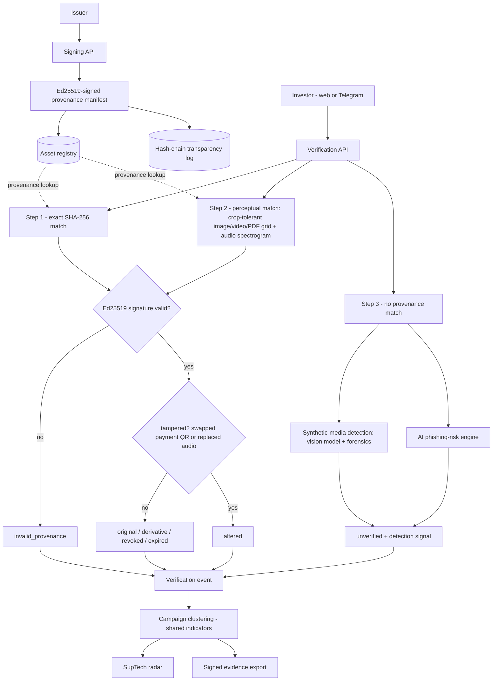

# PramaanSetu

**Proof before persuasion.**

PramaanSetu helps investors check whether a securities-market communication
really came from the organisation named in it. Issuers can sign official
messages and media, investors can verify suspicious content, and regulators can
see related fraud reports as connected campaigns.

Built for SEBI Securities Market TechSprint 2026, Problem Statement 1:
AI-driven detection of synthetic media and phishing.

> Prototype status: the application runs locally and the deterministic
> verification flow is tested. It is not connected to SEBI's production
> registry and is not ready for enforcement or public deployment.

## The problem

Investment scams often borrow the visual identity of SEBI, exchanges, brokers,
and listed companies. A polished PDF, forwarded image, payment QR, or social
post can look official even when it was created by an impersonator.

An AI classifier can flag suspicious language, but it cannot prove who
published a file. It can also produce uncertain results that should not be
treated as confirmed fraud.

PramaanSetu separates those questions:

1. Can the content be matched to a signed communication?
2. Does the issuer signature validate?
3. Was the content copied, recompressed, or altered?
4. If no provenance exists, is the media itself AI-generated or a deepfake, and
   does the message contain phishing signals?
5. Do multiple reports share the same payment handle, phone number, domain, or
   impersonated entity?

This covers both halves of Problem Statement 1: **detecting** malicious
synthetic content (deepfake images/video, synthetic voice, AI phishing) and
**verifying** that legitimate financial communications are genuine.

## What the project includes

### Signing rail

An issuer creates a provenance manifest containing its identity, the content
hash, publication time, approved payment handles, and an optional official
URL. The backend signs the manifest with Ed25519 and adds the asset to a
hash-chained transparency log.

### Investor verifier

An investor can paste a message or upload a file. The verifier checks exact
provenance first, then perceptual similarity and payment QR integrity. Gemini
is used only when no signed match can be found.

### Synthetic-media detection

When content has no provenance match, PramaanSetu asks the second question:
is the media itself AI-generated or a deepfake? Each modality is scored 0–100
by combining two independent layers so a verdict still appears if the model is
rate-limited:

- **Image** — a Gemini vision prompt tuned for GAN/diffusion and face-swap
  artefacts, plus deterministic forensics (error-level analysis and
  noise-uniformity cues).
- **Video** — representative frames are sampled with FFmpeg and scored for
  deepfake cues (per-frame and cross-frame), combined with an audio check.
- **Audio** — a Gemini audio prompt for synthetic/cloned speech, plus
  deterministic spectral-stability and noise-floor forensics.
- **Text** — the phishing risk engine (below) extracts scam signals and
  indicators.

The model leads (0.68) and forensics corroborate (0.32) when both are
available; forensic-only scores are capped so heuristics never over-convict a
real photo. The detector deliberately shows restraint — a genuine photo or a
plain digital graphic is not flagged as synthetic.

### SupTech radar

Verification events are grouped into campaigns when they share indicators.
The regulator view separates confirmed tampering from AI-scored suspicion and
exports signed evidence packs for review.

## Demo

There is no public deployment yet. After starting the project locally, these
screens are available:

| Screen | URL | Purpose |
| --- | --- | --- |
| Overview | <http://localhost:3000> | Product story and trust model |
| Investor verifier | <http://localhost:3000/verify> | Verify a message, image, video, audio file, or PDF |
| Signing rail | <http://localhost:3000/issuer> | Seed demo issuers and sign content |
| SupTech radar | <http://localhost:3000/dashboard> | Review metrics, campaigns, and shared indicators |

For the full guided 5–7 minute demo (mock roles, deepfake detection, swapped-QR,
voice-clone, audio provenance, campaign linking, revocation) see
[DEMO.md](DEMO.md).

### Two-minute walkthrough

1. Open the signing rail and select **initialise demo registry**.
2. Choose a demo issuer, enter a title, and sign a short message.
3. Paste the exact message into the verifier. It should return
   `Verified Original` with a valid issuer signature.
4. Paste a suspicious investment message that includes a UPI handle or phone
   number. With Gemini configured, the verifier returns an AI risk assessment
   and extracts those indicators.
5. Open the SupTech radar to see the new verification events and any linked
   campaign.

The seed endpoint also generates a full demo set — an original image, a
recompressed copy, an altered image/PDF with a replaced payment QR, a genuine
video and a voice-cloned one, a signed audio advisory with a recompressed copy,
and unsigned "flat render" / "camera-like" samples for the synthetic detector.
These are returned as base64 values from `POST /api/seed` for deterministic API
and one-click UI demonstrations.

## Architecture



The deterministic path runs before the AI path. A matching registry record is
not enough by itself: its Ed25519 signature must also validate before the
content can be reported as genuine (otherwise it becomes `invalid_provenance`).
Only when there is no provenance match at all does the media reach the
synthetic-media detector and the phishing-risk engine — AI is the catch-net,
never the proof.

## Verification decisions

| Verdict | Meaning |
| --- | --- |
| `original` | Exact SHA-256 match, valid issuer signature, not revoked, and not expired |
| `derivative` | Perceptual match within the copy threshold, with valid provenance |
| `altered` | Matches a signed asset but contains a local visual edit or an unapproved payment QR |
| `invalid_provenance` | A matching registry record exists, but its signature does not validate |
| `revoked` | The issuer signed the content and later revoked it |
| `expired` | The signature is valid, but the communication is no longer current |
| `unverified` | No signed provenance match was found |

For images and sampled video frames, the current prototype uses a 32 by 32
colour block grid. Up to 4 changed cells is treated as a recompressed copy.
Between 5 and 300 changed cells is treated as a possible alteration. These
thresholds are prototype values and need calibration on real forwarded media.

Audio is matched by a compact spectrogram signature: a recompressed copy of a
signed recording (a forwarded voice note) verifies as a `derivative`, while an
unrelated recording stays `unverified` (the threshold sits well below the
distance to an unrelated clip, so it never false-matches).

When no signed record matches at all, an `unverified` image, video, or audio
file additionally receives a **synthetic-media assessment** (a 0–100 score with
a `likely-authentic` / `uncertain` / `likely-synthetic` label). `unverified`
still never means "fake" on its own — the synthetic score is a separate
detection signal shown alongside the phishing risk.

## Evaluation

The repository contains a reproducible benchmark for the deterministic layer.
Gemini is disabled during this run so results do not depend on a model response
or network access.

```bash
npm run benchmark
```

Latest local run:

| Measurement | Result |
| --- | ---: |
| Exact originals | 100.0% (10/10) |
| Recompressed copy recall | 100.0% (40/40) |
| Altered-content recall | 100.0% (20/20) |
| False matches on unrelated images | 0.0% (0/10) |
| Latency p50 | 35.4 ms |
| Latency p95 | 72.0 ms |

The benchmark above uses Jimp-generated templates and re-compression. It is a
regression check, not a general accuracy claim.

### Realistic transforms

A second benchmark applies the transforms a forwarded image actually goes
through and reports how often the genuine copy is still recognised
(`original`/`derivative`):

```bash
npm run benchmark:real
```

Latest local run (12 signed circulars, AI disabled):

| Transform | Recognised |
| --- | ---: |
| Heavy JPEG (q30) | 100% |
| WhatsApp-like JPEG (q50) | 100% |
| JPEG q70 | 100% |
| Screenshot (down + up resample) | 100% |
| Scale 85% | 100% |
| Crop 5% border | 100% |
| Rotate 2° | 0% |
| False match on unrelated images | 0% |

**Honest read:** the block-average fingerprint is robust to the most common
real-world forwards — re-compression, screenshots, scaling, and small crops —
and produces no false matches. Crop tolerance comes from storing a few
centre-crop fingerprint variants on the *signing* side, so the probe path and
its strict changed-cell thresholds are unchanged (the false-match rate stays
0%). Rotation is the remaining gap: block-average hashing is not
rotation-invariant, so a rotation variant lands in the "altered" band rather
than matching cleanly — augmenting it would raise a false tamper alarm, so a
tilted forward is deliberately left as an honest "unverified". Production would
add feature/keypoint-based matching (e.g. ORB) for rotation. This is a
synthetic-content benchmark; a held-out set from real WhatsApp/Telegram
forwarding and camera photos is still future work.

### Scalability

Verification must compare a submitted image against every signed asset. A plain
linear scan is fine for a demo but O(n) at national scale, so an LSH index
(banded average-hash buckets) narrows the candidates before the exact
comparison. A separate benchmark signs a large corpus and measures the search:

```bash
npm run benchmark:scale        # or: npm run benchmark:scale -- 10000
```

Latest local run at **10,001 signed assets** (correct recall on original /
recompressed / altered / unrelated, no false matches):

| Candidate search (probe precomputed) | Result |
| --- | ---: |
| LSH index (narrowed to ~48 candidates) | ~1.9 ms |
| Full linear scan of all 10,001 assets | ~62 ms |
| Speedup | ~33x |

The exact verdict is still decided by the precise changed-cell comparison; the
index only narrows which assets are compared, so verdict correctness is
unchanged. Production would move this to PostgreSQL + pgvector or FAISS.

### Messaging-app channel (Telegram)

A Telegram bot (`backend/src/bot/`) lets an investor forward a suspicious
message, image, or PDF and get the same verdict the web verifier returns —
meeting victims inside the app where scams actually spread. It activates when
`TELEGRAM_BOT_TOKEN` is set (get one from @BotFather in ~30s). WhatsApp Business
API is the same integration pattern for production.

## Tests

Run the backend test suite from the repository root:

```bash
npm test
```

The current suite contains 18 tests covering:

- exact signed images and text
- recompressed image matching
- payment QR replacement
- unrelated content and false matches
- invalid signatures
- transparency log integrity
- campaign creation from a QR fraud event
- signed evidence packs
- video verification (genuine / recompressed / voice-clone)
- audio provenance (signed / recompressed-copy / unrelated, no false match)
- synthetic-media detection: forensic signal fires on AI-render-like media,
  separates it from camera-like media with no false alarm, and is tallied for
  the SupTech dashboard

Run the full static checks with:

```bash
npm run typecheck
npm --prefix frontend run lint
npm --prefix frontend run build
```

## Quick start

### Prerequisites

- Node.js 20.9 or newer
- npm
- A Gemini API key if you want AI risk scoring for unverified content
- FFmpeg if you want video fingerprinting

### Install and run

```bash
git clone https://github.com/RajdeepKushwaha5/PramaanSetu.git
cd PramaanSetu

npm install
npm run install:all

cp backend/.env.example backend/.env
cp frontend/.env.example frontend/.env.local

npm run dev
```

On Windows PowerShell, replace the two `cp` commands with:

```powershell
Copy-Item backend/.env.example backend/.env
Copy-Item frontend/.env.example frontend/.env.local
```

The frontend runs on <http://localhost:3000>. The backend runs on
<http://localhost:4000>.

Signing and deterministic verification work without Gemini. If no Gemini key
is configured, AI risk analysis is reported as unavailable.

### Run each service separately

```bash
npm --prefix backend run dev
npm --prefix frontend run dev
```

## Configuration

### Backend

Configure `backend/.env`.

| Variable | Required | Default | Purpose |
| --- | --- | --- | --- |
| `GEMINI_API_KEYS` | No | Empty | Comma-separated Gemini keys for risk analysis |
| `GEMINI_MODEL` | No | `gemini-2.5-flash` | Model used for unverified content |
| `GEMINI_COOLDOWN_MS` | No | `60000` | Cooldown after a key is rate-limited |
| `PORT` | No | `4000` | Express server port |
| `CORS_ORIGIN` | No in development | Allow all | Comma-separated frontend origins |
| `ADMIN_API_KEY` | Production administration | Empty | Protects issuer creation and production seeding |
| `DEMO_MODE` | No | Enabled outside production | Allows seeded demo issuers to sign without an issuer key |
| `NODE_ENV` | No | `development` | Disables automatic demo mode when set to `production` |

The key manager accepts one key, a comma-separated pool, or numbered variables
such as `GEMINI_API_KEY_1`. Keys stay in the backend and are never sent to the
browser.

### Frontend

Configure `frontend/.env.local`.

| Variable | Required | Default | Purpose |
| --- | --- | --- | --- |
| `NEXT_PUBLIC_API_URL` | No | `http://localhost:4000` | Public URL of the backend |

### Local data

The prototype writes issuers, signed assets, log entries, and verification
events to `backend/data/db.json`. The file is created on the first mutation and
is ignored by Git.

## API

| Method | Endpoint | Purpose |
| --- | --- | --- |
| `GET` | `/api/health` | Capabilities, degraded status, and store counts |
| `GET` | `/api/issuers` | Public issuer list |
| `POST` | `/api/issuers` | Create an issuer with `x-admin-key` |
| `POST` | `/api/sign` | Sign content with `x-issuer-key`, except approved demo issuers in demo mode |
| `POST` | `/api/verify` | Run provenance, tamper, synthetic-detection, and fallback risk checks |
| `POST` | `/api/revoke` | Revoke (or restore) a signed asset with `x-issuer-key` |
| `POST` | `/api/risk` | Run the Gemini risk engine directly |
| `POST` | `/api/seed` | Create the local synthetic demo set |
| `GET` | `/api/campaigns` | List connected fraud campaigns |
| `GET` | `/api/dashboard` | Aggregate regulator metrics |
| `GET` | `/api/events` | Return the latest 100 verification events |
| `GET` | `/api/log` | Inspect transparency log entries and integrity |
| `GET` | `/api/evidence` | Export a signed system snapshot |
| `GET` | `/api/evidence/:campaignId` | Export a signed campaign evidence pack |

## Monitoring

The SupTech radar polls aggregate metrics every five seconds. The backend also
exposes:

- `/api/health` for service capabilities, a degraded-status list (missing
  FFmpeg / Gemini keys, or a failed log-integrity check → `degraded`/`critical`),
  and local store counts
- `/api/dashboard` for verdict totals and top fraud indicators
- `/api/log` for transparency-chain integrity
- `/api/events` for the latest verification events

There is no production metrics or tracing stack yet. Request latency, error
rates, uptime, and Gemini usage should be sent to a dedicated observability
system before deployment.

## Project structure

```text
pramaansetu/
├── frontend/
│   ├── src/app/                 Next.js routes and page UI
│   ├── src/components/          App shell, mock role login, interactive topology
│   └── src/lib/api.ts           Backend URL helper
├── backend/
│   ├── src/ai/                  Gemini client, key pool, and risk engine
│   ├── src/detect/              Synthetic-media detection (vision/audio + forensics)
│   ├── src/bot/                 Telegram verification channel
│   ├── src/crypto/              Ed25519 signing helpers
│   ├── src/db/                  JSON store and shared types
│   ├── src/fingerprint/         Hashing, image, video, audio, and QR checks
│   ├── src/routes/              Express API routes
│   ├── src/services/            Signing, verification, campaigns, and evidence
│   ├── scripts/                 Deterministic, realistic, and scale benchmarks
│   └── tests/                   Node test suite
├── STRUCTURE.md                 Expanded repository map
└── package.json                 Monorepo scripts
```

## Technical decisions and trade-offs

### Deterministic checks before AI

Cryptographic and perceptual checks are easier to explain and reproduce than a
model response. Gemini is reserved for content that has no known provenance.
The downside is that unknown but genuine content remains unverified until an
issuer signs it.

### C2PA-inspired manifest instead of full C2PA

The current JSON manifest proves the content hash and issuer claim with
Ed25519. It was practical for a hackathon prototype, but it is not a conformant
C2PA manifest store and will not interoperate with C2PA tooling yet.

### JSON storage instead of PostgreSQL

The local store keeps setup simple and makes the demo portable. It is not
suitable for concurrent writes, horizontal scaling, retention controls, or
large fingerprint indexes.

### Block-grid fingerprints instead of a learned matcher

The 32 by 32 colour grid is fast, local, and easy to inspect. It handles
recompression, screenshots, scaling, and small crops (the last via centre-crop
fingerprint variants stored at signing time), but still needs rotation
invariance and stronger robustness to more aggressive transformations.

### Connected components for campaign discovery

Union-find clustering gives a direct explanation for why reports were grouped.
It works well for shared exact indicators, but production correlation should
also handle fuzzy entities, infrastructure reuse, time windows, and confidence
weights.

## Security notes

The prototype includes:

- issuer-bound signing keys through the `x-issuer-key` header
- admin-gated issuer creation
- production-gated demo seeding
- Ed25519 signatures for provenance manifests and evidence exports
- Helmet headers, CORS controls, and per-IP rate limiting
- MIME validation from file magic bytes
- a transparency log checked against both the hash chain and asset registry
- no Gemini key details in the public health response

Private issuer keys and the evidence signing key are still stored in the local
JSON database. Production keys should be held in an HSM or KMS. The signing
flow also needs authenticated issuer accounts, key rotation, audit access
controls, and constant-time secret comparison.

**Dependency audit.** The backend production dependency audit is clean
(`npm --prefix backend audit --omit=dev` reports 0 vulnerabilities) — the
Telegram bot talks to the Bot API directly over `fetch`, avoiding heavy client
libraries. The frontend reports a high-severity PostCSS advisory that is
**bundled transitively inside Next.js's own build toolchain**
(`next/node_modules/postcss`); it affects the build step, not the served
runtime, and the only offered "fix" downgrades Next.js to v9 (a breaking
change). It will clear with a future Next.js release rather than a local change.
See [SECURITY.md](SECURITY.md) for the full advisory-by-advisory breakdown.

## Deployment

The project is not publicly deployed.

The frontend and backend are separate services:

- Deploy `frontend/` to Vercel and set `NEXT_PUBLIC_API_URL`.
- Deploy `backend/` to a long-running Node host such as Railway or Render.
- Install FFmpeg on the backend host for video verification.
- Set `NODE_ENV=production`, `CORS_ORIGIN`, `ADMIN_API_KEY`, and the Gemini
  variables on the backend.
- Keep `DEMO_MODE` disabled in production.
- Replace the JSON store and local key storage before accepting real issuers or
  investor submissions.

There is no CI/CD workflow in the repository yet. Tests, type checks, linting,
and the production frontend build currently need to be run manually.

## Path to production

The prototype proves the *idea and the mechanism*; production must prove the
*trust chain*. The honest boundaries, and how each is closed for production:

| Prototype today | Production |
| --- | --- |
| Issuer identity is a pre-approved demo record | Validate identity against authoritative SEBI / exchange registries; issuer onboarding + approval |
| Private keys stored in the local JSON store | Keys held in HSM / KMS; the app stores only key ids, public keys, and status |
| Evidence signed by a locally-generated key | Anchor evidence to a regulator-controlled key / certificate chain |
| Hash-chain transparency log (internal) | Publish log roots as a Merkle tree for independent, third-party verification |
| JSON file store + in-memory LSH index | PostgreSQL + pgvector / FAISS, object storage, worker queues, Redis |
| Synthetic + realistic-transform benchmark | Held-out benchmark from real WhatsApp/Telegram forwarding and camera photos |
| Ed25519-signed JSON manifest | Conformant C2PA manifest store |

None of these change the architecture — they are well-understood swaps. The
signing rail, verdict engine, campaign graph, and evidence flow stay as they are.

### Already built (beyond the original plan)

Image, PDF (page rendering + QR extraction), and video (frame fingerprinting)
verification; audio provenance (recompressed copy of a signed recording -> a
derivative) and voice-clone / audio-replacement detection on matched videos;
**synthetic-media detection** (deepfake image/video and synthetic-voice scoring
via a vision/audio model plus deterministic forensics); crop-tolerant image
matching; QR payment-tamper detection; a tamper heatmap; issuer revocation; a
stable-ID campaign graph; signed evidence export; a Telegram channel; a mock
role login (Investor / Issuer / Regulator); and an LSH scalability index.

## Technology

- Next.js 16 and React 19
- Express 5 and TypeScript
- Node.js crypto with Ed25519
- Google Gemini through `@google/genai` (phishing risk + deepfake vision/audio)
- Jimp for image processing and deterministic forensics (ELA, noise cues)
- jsQR and qrcode for payment QR checks; pdfjs-dist + pdf-lib for PDF rendering
- FFmpeg for video frame extraction and audio decoding/fingerprinting
- Zod for request validation
- Helmet, CORS, and Express rate limiting
